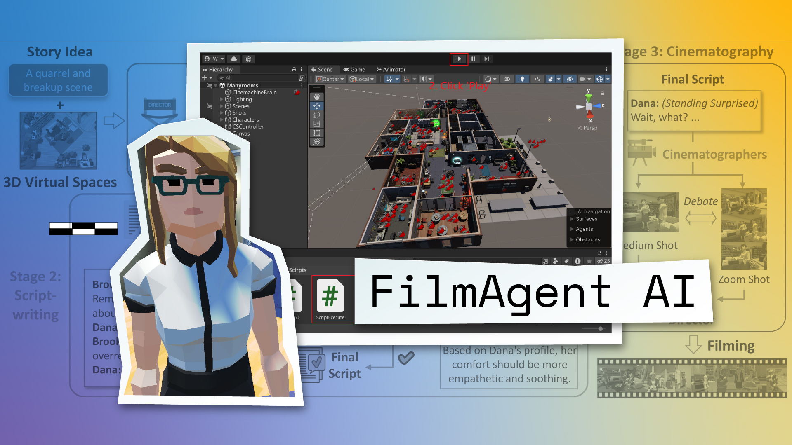

<p align="center">
    
<p>

<h2 align="center"> <a href="https://github.com/HITsz-TMG/FilmAgent">FilmAgent: A Multi-Agent Framework for End-to-End Film Automation in Virtual 3D Spaces</a></h2>
<!-- <h5 align="center"> If you like our project, please consider giving us a star ⭐ on GitHub to stay updated with the latest developments.  </h2> -->
<h4 align="center">

<div align="center">
 


<!--  -->

<!-- [](https://filmagent.github.io/)
[](https://arxiv.org/abs/2501.12909)
[](https://www.youtube.com/watch?v=hTI-0777iHU)
 -->

</h4>

<div align="center">

<!-- **Affiliations:** -->

_**Zhenran Xu, Longyue Wang, Jifang Wang, Zhouyi Li, Senbao Shi, Xue Yang, Yiyu Wang, Baotian Hu, Jun Yu, Min Zhang**_

🎯  [**Project Page**](https://filmagent.github.io)  :octocat:  [**Code**](https://github.com/HITsz-TMG/FilmAgent)  📝  [**Paper**](https://arxiv.org/abs/2501.12909) 🧑‍💻  [**Slides**](https://filmagent.github.io/static/SA24_FilmAgent.pdf)  📽️  [**Video**](https://www.youtube.com/watch?v=hTI-0777iHU)

<a href="https://trendshift.io/repositories/12871" target="_blank"></a>

</div>

#

**FilmAgent** is a multi-agent collaborative system for end-to-end film automation in 3D virtual spaces. 
FilmAgent simulates key crew roles—directors, screenwriters, actors, and cinematographers, and integrates efficient human workflows within a sandbox environment.

<div align=center></div>

## 💥 News

- `2025/2/24`: 🚀 We have integrated **DeepSeek**-v3 and r1 for model selection, allowing for more sophisticated decision-making processes.
- `2025/2/11`: 🎬 We’ve just released a fan-made video about ***NeZha2***, in celebration of its record-breaking success at the box office. Click the image below to watch the video! 👇
  [<div align=center></div>](https://www.youtube.com/watch?v=jY3n-AzBtUQ)
- `2025/1/23`:  🙌 We're excited that FilmAgent is recommended by [AK](https://x.com/_akhaliq/status/1882268452716728789), [el.cine](https://x.com/EHuanglu/status/1882294685919772928) and [Theoretically Media](https://www.youtube.com/watch?v=0ebXKegfxWk&t=899s). Thanks!
- `2025/1/22`: 📄 Our paper is now accessible at https://arxiv.org/abs/2501.12909.


## 🚀 Framework

Following the traditional film studio workflow, we divide the whole film automation process into three sequential stages: idea development, scriptwriting and cinematography, and apply the **Critique-Correct-Verify**, **Debate-Judge** collaboration strategies. After these stages, each line in the script is specified with the positions of the actors, their actions, their dialogue, and the chosen camera shots.

<div align=center></div>

## 🌟 Build Your own Film with FilmAgent

1. Install Package
```Shell
conda create -n filmagent python==3.9.18
conda activate filmagent
pip install -r env.txt
```

2. Create `Script` and `Logs` folders in the Filmagent directory, then replace the absolute pathname '/path/to/' with your specific path and modify the `topic` in the `main.py`. Modify the api_key in `LLMCaller.py`. Run the following commands to get the movie script created by the agents collaboratively:
```bash
cd /path/to/FilmAgent
conda activate filmagent
python main.py --model "gpt-4o" # openai
# python main.py --model "deepseek-chat" ## deepseek-v3
# python main.py --model "deepseek-reasoner" ## deepseek-r1 Using this model for a multi-agent process will be very slow, you could try using a single-agent process instead. (Refer to step 6)
```

3. We use [ChatTTS](https://github.com/2noise/ChatTTS) to provide voice acting for the characters in the script. You need to download the [ChatTTS](https://github.com/2noise/ChatTTS) repository to the `TTS` directory. Then replace the absolute pathname '/path/to/' with your specific path in the `tts_main.py`. Run the following commands to deploy the text-to-speech service:
```bash
cd /path/to/TTS
conda create -n tts python==3.9.18
conda activate tts
pip install -r tts_env.txt
python tts_main.py
```

4. Modify the `Script_path`, `actos_path`, `Audio_path` and `url` in the `GenerateAudio.py`. Run the following commands to get the audio files:
```bash
cd /path/to/FilmAgent
conda activate filmagent
python GenerateAudio.py
```

5. We now have the `script.json`, `actors_profile.json`, and a series of `.wav` audio files. Next, we need to execute the script in Unity. The recommended version of the Unity editor is **Unity 2022.3.14f1c1**. You need to download the Unity project file we provide [[Dropbox](https://www.dropbox.com/scl/fi/atxhxnqppeofmt471dxr5/TheBigBang.zip?rlkey=o7zuqficetabkk2h1w1npkv3v&st=5s41rzdv&dl=0)][[Baidu Disk](https://pan.baidu.com/s/10wgfvtcG-xnx1fA9Rd_zwg?pwd=5aif)]. After decompression, open `TheBigBang\Assets\TheBigBang\Manyrooms.unity` with Unity. Then replace all the absolute pathnames '/path/to/' with your specific path in `TheBigBang\Assets\Scirpts\StartVideo.cs` and `TheBigBang\Assets\Scirpts\ScriptExecute.cs`. Press **'ctrl+R'** in the unity interface to recompile, click **'Play'** to enter Game mode, then press **'E'** to start executing the script (sometimes the audio files load slowly, so you may need to play it 2 or 3 times before it can run normally).

<div align=center></div>  

6. For the tests on 15 topics in our experimental section, we provide three .py files: `test_full.py` (The full FilmAgent framework, utilizing multi-agent collaboration.), `test_no_interation.py` (A single agent is responsible for planning, scriptwriting, and cinematography, representing our FilmAgent framework without multi-agent collaboration algorithms.) and `test_cot.py` (A single agent generates the chain-of-thought rationale and the complete script). Modify the `model` in these `.py` files, you can try different LLMs.

## 🌈 Case Study

### 🤝 What does Multi-Agent Collaboration do?
The following table records some comparisons of the scripts and camera settings **before (⬅️) and after (➡️)** multi-agent collaboration, with excerpts from their discussion process.

<div align=center></div>

📌 **Case Highlights:**
- **Case #1** shows that Director-Screenwriter discussion reduces hallucinations in non-existent actions (e.g., standing suggest), enhances plot coherence, and ensures consistency across scenes.
- **Case #2** shows that Actor-Director-Screenwriter discussion improves the alignment of dialogue with character profiles.
- **Case #3**, in the Debate-Judge method in cinematography, demonstrates the correction of an inappropriate dynamic shot, which is replaced with a medium shot to better convey body language.
- **Case #4** replaces a series of identical static shots with a mix of dynamic and static shots, resulting in a more diverse camera setup.

### ⚖️ Comparison with Sora

<div align=center></div>

While Sora (🔗 [Video](https://github.com/user-attachments/assets/65bb4c12-cba0-4ee9-a673-63ea5103fd76)) shows great adaptability to diverse locations, characters and shots, it **struggles with consistency and narrative delivery**, along with **strange artifacts**. 

In contrast, FilmAgent requires pre-built 3D spaces, but it produces **coherent, physics-compliant** videos with strong **storytelling capabilities** (▶️ Watch on [Youtube](https://www.youtube.com/watch?v=yOOycdfolFY)).

### ✨ Integration with Text-to-Video Models (e.g. Sora, Vidu)

We are currently working towards **merging the power of text-to-video models with FilmAgent**, unlocking enhanced storytelling, greater adaptability, and improved consistency. 🚀

Here is a preview of our work—a fan-made tribute to the box office phenomenon *NeZha2* [▶️[video link](https://www.youtube.com/watch?v=jY3n-AzBtUQ)]. This video celebrates *NeZha2* surpassing a CNY 8 billion at the box office, officially crowning it as the highest-grossing film in a single territory! 🎉 

## 📚 Citation

If you find FilmAgent useful for your research and applications, please cite using this BibTeX:
```bibtex
@misc{xu2025filmagent,
      title={FilmAgent: A Multi-Agent Framework for End-to-End Film Automation in Virtual 3D Spaces}, 
      author={Zhenran Xu and Longyue Wang and Jifang Wang and Zhouyi Li and Senbao Shi and Xue Yang and Yiyu Wang and Baotian Hu and Jun Yu and Min Zhang},
      year={2025},
      eprint={2501.12909},
      archivePrefix={arXiv},
      primaryClass={cs.CL},
      url={https://arxiv.org/abs/2501.12909}, 
}
```
